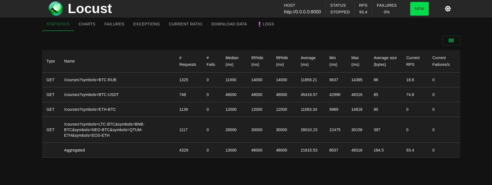

# Courses
_______

* для получения цены валютных пар указать в query запросе нужно их указать через - (/courses&symbols=BTC-USDT)
* multy query запрос (/courses&symbols=BTC-USDT&symbols=ETH-BTC&symbols=BTC-RUB)

## Нагрузочное тестирование
________
